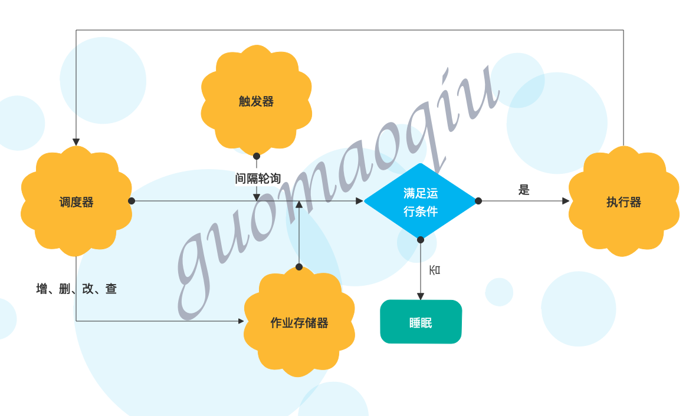
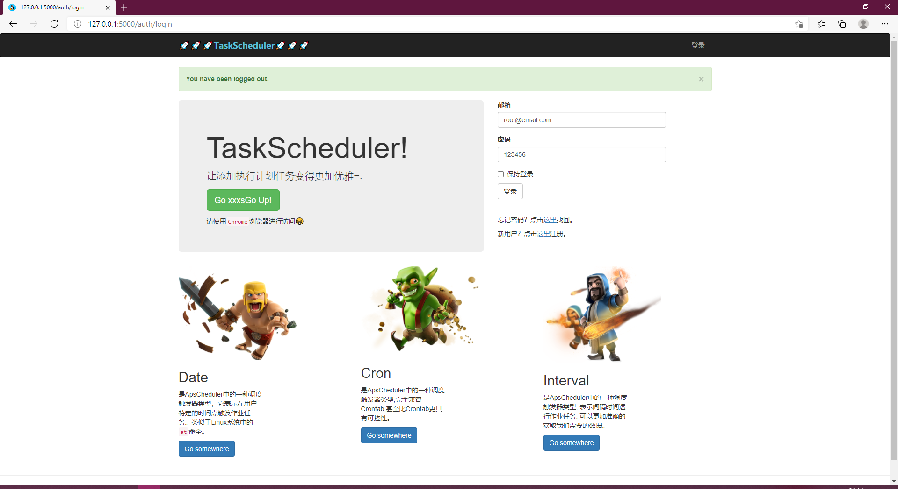
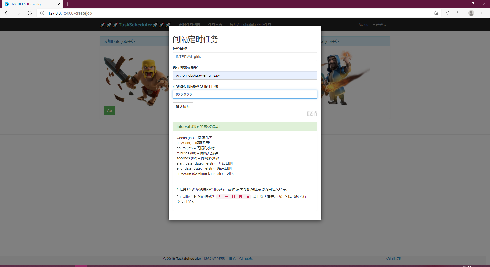
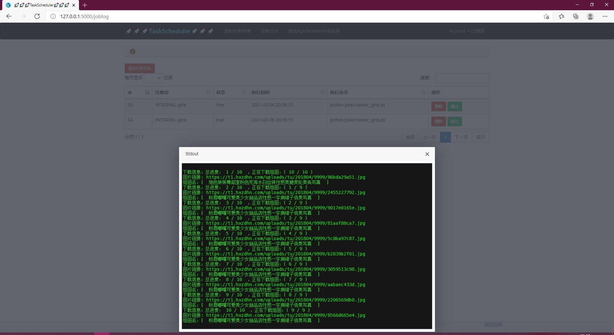
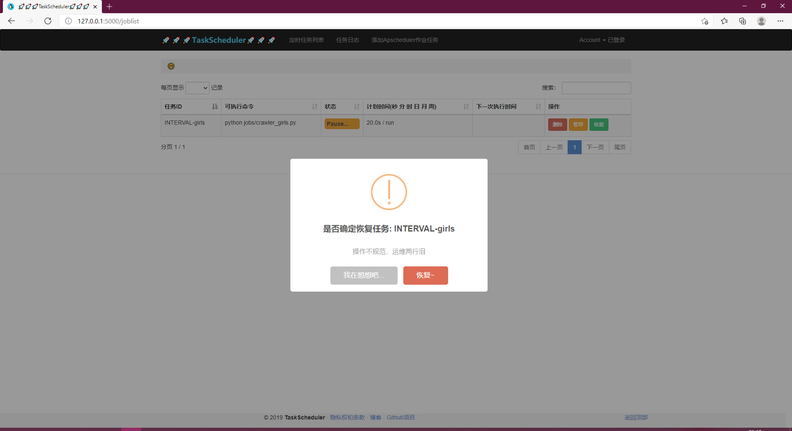

基于flask和apscheduler的可视化操作任务调度系统，支持一次性任务、定时任务、周期任务。

基于[JobCenter](https://github.com/guomaoqiu/JobCenter)修改

# 特点:
* 可视化界面操作
* 定时任务统一管理
* 完全兼容Crontab
* 支持秒级定时任务
* 作业任务可搜索、暂停、删除
* 作业任务持久化存储、三种不同触发器类型作业动态添加

# 用法:
```
$ git clone git@github.com:barry-ran/TaskScheduler.git
$ cd TaskScheduler
$ pipenv install --dev
$ pipenv shell
# 先在config.py中的mysql_info配置数据库用户名、密码
# 需提前创建数据库（jobs），空数据库即可
$ flask init 

$ flask run
* Running on http://127.0.0.1:5000/
```

# 常用命令

```
$ pipenv install  # 创建虚拟环境并安装依赖
$ pipenv shell  # 激活虚拟环境
$ flask initdb  # 初始化数据库
$ flask initdb --drop # 删除数据
```

# 介绍
## APScheduler工作流程图


## 清爽的登录界面
内置管理员账户，可直接登录


## 针对不同触发器动态增加定时任务
例如下面添加了一个每隔60s定时爬取小姐姐图片的python脚本任务(脚本在jobs/crawler_girls.py中)


## 任务执行输出日志持久化存放并展示
可以在任务输出中查看我们已经爬取到了小姐姐图片地址


## 任务列表中暂停、恢复已添加定时任务



# 开发相关
## ubuntu安装mariadb
```
# 安装服务
apt-get install mariadb-server
# 启动
sudo systemctl start mariadb
sudo systemctl enable mariad
# 设置密码（第一次安装密码为空，直接回车即可）
mysql -u root -p
use mysql;
update user set authentication_string=password("123456") where user="root";
flush privileges;
# 创建数据库
create database jos;
```
参考文档：
[ubuntu18.04下安装mariaDB](https://www.cnblogs.com/lzwangshubo/p/9977997.html)

[MariaDB设置密码](https://www.cnblogs.com/cpl9412290130/p/9583868.html)

